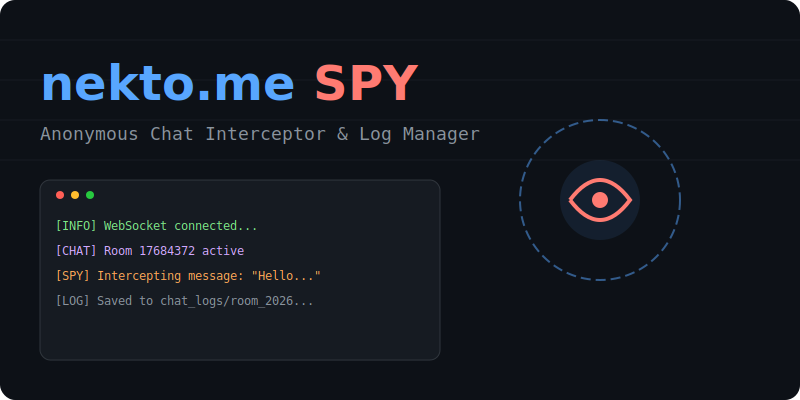
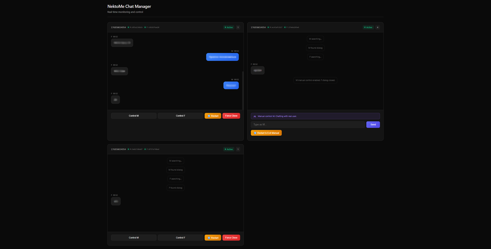

# NEKTO.ME MONITOR



<div align="center">

**Система мониторинга и управления чатами Nekto.me в реальном времени**

[](https://www.python.org/downloads/)
[](https://opensource.org/licenses/MIT)
[](https://fastapi.tiangolo.com/)

[English](#english) | [Русский](#russian)

</div>

---

## 🇷🇺 Russian

### 📋 Описание

**Nekto.me Monitor** — это продвинутая система для мониторинга и управления множественными клиентами Nekto.me. Проект позволяет перехватывать, пересылать сообщения между ботами и управлять диалогами через интуитивный веб-интерфейс в реальном времени. На данный момент поддерживается только общение M-F.

### ✨ Основные возможности

- 🤖 **Множественные клиенты**: Одновременное управление несколькими ботами (мужские/женские профили)
- 💬 **Перехват сообщений**: Автоматическая ретрансляция сообщений между клиентами
- 🎮 **Веб-панель управления**: Современный dashboard для мониторинга и контроля
- 🔄 **Режимы работы**: Автоматический и ручной режим управления диалогами
- 📊 **Логирование**: Автоматическое сохранение всех диалогов в JSON формате
- ⚡ **Real-time обновления**: WebSocket соединение для мгновенного обновления статуса
- 🎯 **Гибкая настройка**: Фильтры по возрасту, полу, интересам через config.ini
- 🔌 **FastAPI + SocketIO**: Современный асинхронный backend

### 🖼️ Интерфейс



### 🚀 Быстрый старт

#### Требования

- Python 3.12 или выше
- pip (менеджер пакетов Python)

#### Установка

1. **Клонируйте репозиторий:**
```bash
git clone https://github.com/S1ii/nekto.me-spion.git
cd nekto.me-spion
```

2. **Установите зависимости:**
```bash
pip install -r requirements.txt
```

3. **Настройте конфигурацию:**
```bash
cp config.ini.example config.ini
```

Отредактируйте `config.ini` и добавьте ваши токены и настройки клиентов.

4. **Запустите приложение:**
```bash
# Запуск основного скрипта (консольный режим)
python run.py

# Или запуск с веб-интерфейсом
python web_server.py
```

5. **Откройте веб-панель:**

Перейдите по адресу: `http://localhost:8000`

### ⚙️ Конфигурация

Пример настройки клиента в `config.ini`:

```ini
[settings]
clients = client-1-M client-2-F
debug = False

[client/client-1-M]
token = YOUR_NEKTO_TOKEN_HERE
ua = YOUR_USER_AGENT_HERE
age = 18,25
wish-age = 18,25
sex = M
wish-sex = F
role = False
adult = True
```

#### Параметры клиента:

| Параметр | Описание |
|----------|----------|
| `token` | Токен авторизации Nekto.me |
| `ua` | User-Agent браузера |
| `age` | Ваш возраст (диапазон) |
| `wish-age` | Желаемый возраст собеседника |
| `sex` | Ваш пол (M/F) |
| `wish-sex` | Желаемый пол собеседника |
| `adult` | Флирт 18+ (True/False) |
| `role` | Режим ролевых игр (True/False) |

### 📁 Структура проекта

```
nekto.me-spion/
├── src/                   # Исходный код
│   ├── __init__.py       # Package initialization
│   ├── client.py         # Класс клиента Nekto.me
│   ├── chat.py           # Базовая логика чата
│   ├── chat_manager.py   # Менеджер множественных диалогов
│   ├── config.py         # Загрузка конфигурации
│   └── utils.py          # Утилиты
├── assets/               # Визуальные ресурсы
│   ├── banner.svg        # SVG баннер
│   └── dashboard.png     # Скриншот dashboard
├── run.py                # Точка входа (консольный режим)
├── web_server.py         # FastAPI веб-сервер
├── config.ini.example    # Пример конфигурации
├── requirements.txt      # Зависимости
├── LICENSE               # Лицензия
├── .gitignore            # Git ignore
└── chat_logs/            # Логи диалогов (создается автоматически)
```

### 🔧 API Endpoints

#### REST API:

- `GET /` - Веб-интерфейс dashboard
- `GET /api/rooms` - Список всех активных комнат
- `GET /api/rooms/{room_id}` - Информация о конкретной комнате
- `POST /api/send-message` - Отправка сообщения в ручном режиме
- `POST /api/toggle-control` - Переключение авто/ручной режим
- `POST /api/force-close` - Принудительное закрытие диалога
- `POST /api/restart-search` - Перезапуск поиска собеседника

#### WebSocket:

- `ws://localhost:8000/ws` - Real-time обновления статуса комнат и сообщений

### 🎯 Сценарии использования

1. **Автоматический режим**: Боты автоматически пересылают сообщения между собеседниками
2. **Ручной режим**: Возможность вручную управлять одним из клиентов через веб-интерфейс
3. **Мониторинг**: Просмотр всех активных диалогов в реальном времени
4. **Логирование**: Архивирование всех разговоров для последующего анализа

### 📝 Логи

Все диалоги автоматически сохраняются в директорию `chat_logs/` в формате JSON:

```json
{
  "client_token": "d95a1368cb",
  "client_sex": "M",
  "start_time": "2026-01-15T02:32:26",
  "end_time": "2026-01-15T02:45:13",
  "messages": [
    {
      "timestamp": "2026-01-15T02:32:30",
      "sender": "interlocutor",
      "message": "Привет!"
    }
  ]
}
```

### ⚠️ Важные замечания

- 🔒 **Безопасность**: Никогда не публикуйте `config.ini` с реальными токенами
- 📊 **Производительность**: Рекомендуется не более 10 одновременных клиентов
- 🌐 **Сеть**: Требуется стабильное интернет-соединение
- ⚖️ **Ответственность**: Используйте в соответствии с правилами Nekto.me

### 🐛 Устранение неполадок

**Проблема**: Клиент не подключается
- Проверьте валидность токена
- Убедитесь в наличии интернет-соединения
- Проверьте правильность User-Agent

**Проблема**: Сообщения не пересылаются
- Убедитесь, что оба клиента (M и F) подключены
- Проверьте логи в консоли (`debug = True` в config.ini)

### � Благодарности

Этот проект основан на оригинальной работе [pashtetx/nekto.me-spion](https://github.com/pashtetx/nekto.me-spion).

**Основные доработки:**
- ✨ Веб-интерфейс с real-time мониторингом через WebSocket
- 🎮 Ручное управление клиентами через dashboard
- 📊 Улучшенная система логирования диалогов
- 🔄 Менеджер множественных параллельных диалогов
- 🎨 Современный dark theme UI

### �📄 Лицензия

Этот проект распространяется под лицензией MIT. См. файл [LICENSE](LICENSE) для подробностей.

---

## 🇬🇧 English

### 📋 Description

**Nekto.me Monitor** is an advanced system for monitoring and managing multiple Nekto.me clients. The project enables message interception, relay between bots, and dialog management through an intuitive real-time web interface.

### ✨ Key Features

- 🤖 **Multiple Clients**: Simultaneous management of several bots (male/female profiles)
- 💬 **Message Interception**: Automatic message relay between clients
- 🎮 **Web Control Panel**: Modern dashboard for monitoring and control
- 🔄 **Operation Modes**: Automatic and manual dialog management modes
- 📊 **Logging**: Automatic saving of all dialogs in JSON format
- ⚡ **Real-time Updates**: WebSocket connection for instant status updates
- 🎯 **Flexible Configuration**: Filters by age, gender, interests via config.ini
- 🔌 **FastAPI + SocketIO**: Modern asynchronous backend

### 🚀 Quick Start

#### Requirements

- Python 3.12 or higher
- pip (Python package manager)

#### Installation

1. **Clone the repository:**
```bash
git clone https://github.com/S1ii/nekto.me-spion.git
cd nekto.me-spion
```

2. **Install dependencies:**
```bash
pip install -r requirements.txt
```

3. **Configure:**
```bash
cp config.ini.example config.ini
```

Edit `config.ini` and add your tokens and client settings.

4. **Run the application:**
```bash
# Run main script (console mode)
python run.py

# Or run with web interface
python web_server.py
```

5. **Open web panel:**

Navigate to: `http://localhost:8000`

### � Credits

This project is based on the original work by [pashtetx/nekto.me-spion](https://github.com/pashtetx/nekto.me-spion).

**Major enhancements:**
- ✨ Web interface with real-time WebSocket monitoring
- 🎮 Manual client control via dashboard
- 📊 Enhanced dialog logging system
- 🔄 Multiple parallel dialog manager
- 🎨 Modern dark theme UI
- 📁 Professional project structure

### �📄 License

This project is licensed under the MIT License. See the [LICENSE](LICENSE) file for details.

---

<div align="center">

**Made with ❤️ for chat automation**

⭐ Star this repo if you find it useful!

</div>
